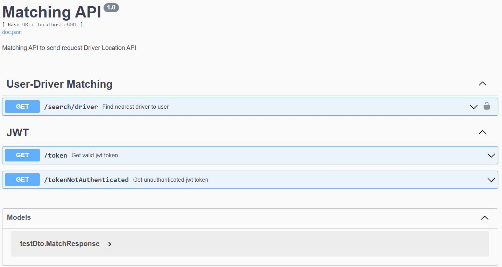
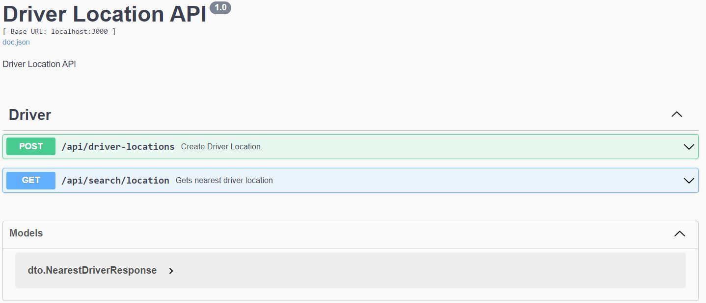

# Driver-Location-and-Matching-Project

This is the project that allows users to find the driver closest to them. The project was done using Echo framework.

The project consist of 2 parts;

- A Matching API Service that finds the nearest driver with the rider location using the Driver Location API.
- A Driver Location API that uses location data stored in a MongoDB collection

## Table of content

- [APIs](#apis)
    - [Matching API](#matching-api)
        - [Get JWT](#get-jwt)
        - [Get Wrong JWT](#get-wrong-jwt)
        - [Search Driver](#search-driver)
    - [Driver Location](#driver-location)
        - [Create Locations](#create-driver-locations)
        - [Search Location](#search-location)
- [Database](#database)
- [Circuit Breaker](#circuit-breaker)
- [Swagger](#swagger)
- [Tests](#tests)
    - [Unit](#unit)
- [Docker Compose](#docker-compose)
- [Dockerfile](#dockerfile)
- [Links](#links)

## APIs

### Matching API
There are 3 APIs created for users.

#### Get JWT
This API gives users a valid JWT Token for authenticated use of `Search Driver` API.<br>
Users can send requests to APIs using this token.

#### Get Wrong JWT
This API gives users an invalid JWT Token.
There is a field named Authenticated set to 'false' in the token. When users try to send requests to the API, they get an 'Unauthorised Token' message.
This proves users can not request `Search Driver` without a valid token.


#### Search Driver
This API brings the closest driver's distance as KM between the user and the driver.
It takes longitude, latitude and a distance as query parameters.

This API can only be called with valid JWT which include Authenticated set to 'true'

### Driver Location
There are 2 APIs about driver locations.

#### Create Locations
This API works in 2 ways.
- Generates driver location with given latitude and longitude. A GeoJSON object is inserted with given information to mongodb.
- Generates driver locations with a given location file. Skips the header line and inserts GeoJSON objects which created with the rest of the lines to mongodb.

#### Search Location
This API brings up the closest driver's distance to a given point. It takes a GeoJSON object and distance. Gives a distance and a random nick that belongs to driver.
Also, `Search Location` can only be called from the Matching API. A secret key and value which is known between these services, ensures this. The key and value transmitting in header and stored in config files.

Geospatial query operator named `near` used to get drivers in specified point and radius.
And then, the results are compared with user location using [Haversine](#https://pkg.go.dev/github.com/umahmood/haversine) package.

Haversine package converts location into a geospatial object by latitude and longitude. After it is coverted, it can give the distance between two geospatials as km and mile.

## Database
MongoDB is used as database. Location information stored as `point` collection. <br>
An index has been declared to use location query.

## Circuit Breaker
Circuit breaker pattern implemented at matching API. Hystrixgo used to implement circuit breaker pattern.<br>
<br>
Hystrix options are :
```
Timeout:                500,
RequestVolumeThreshold: 5,
ErrorPercentThreshold:  50,
SleepWindow:            hystrix.DefaultSleepWindow,
```

## Swagger
API documentations were created with [swaggo](https://github.com/swaggo/swag).
Run swag init in the project's root folder which contains the main.go file. This will parse comments and generate the required files (docs folder and docs/docs.go).
<br>Swaggo tags placed up to controllers.

Swagger URLs:
- [ ] Matching API: `http://localhost:3001/swagger/index.html`
- [ ] Driver Location API: `http://localhost:3000/swagger/index.html` 

Swagger screen shots:
- Matching API
  
- Driver Location API
  

## Tests
Tests were done with gomock. Unit tests were written for handler and service classes. Tests written using Golang test util were positioned at
test directory. Mock services were used to write tests that were created by ``mockgen`` served under mock package.
<br>
<br>
Note: Could not write tests for service and controller which uses multipart files.

## Docker Compose
Compose file consist of mongodb, mongo-express and golang applications.
Golang applications were containerised with their own dockerfile at project base directory.

The whole application can be run with command `docker-compose up -d` placed at docker-compose.yml

## Dockerfile
Dockerfile was created to run applications. Dockerfile consists of application execute file and config
files.


## Links
* [Echo Framework](https://github.com/golang/mock)
* [GeoJSON](https://www.mongodb.com/docs/manual/reference/geojson/)
* [GeoJSON Queries](https://www.mongodb.com/docs/manual/geospatial-queries/#std-label-geospatial-geojson)
* [GeoJSON 2dsphere Index](https://www.mongodb.com/docs/manual/core/2dsphere/)
* [Haversine](https://pkg.go.dev/github.com/umahmood/haversine#section-readme)
* [Hystrix](https://pkg.go.dev/github.com/afex/hystrix-go/hystrix)
* [Mockgen](https://github.com/golang/mock)
* [Swagger](https://github.com/swaggo/swag)
